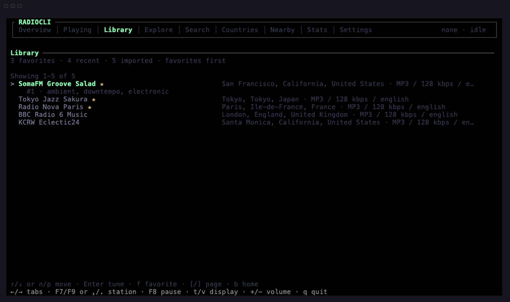
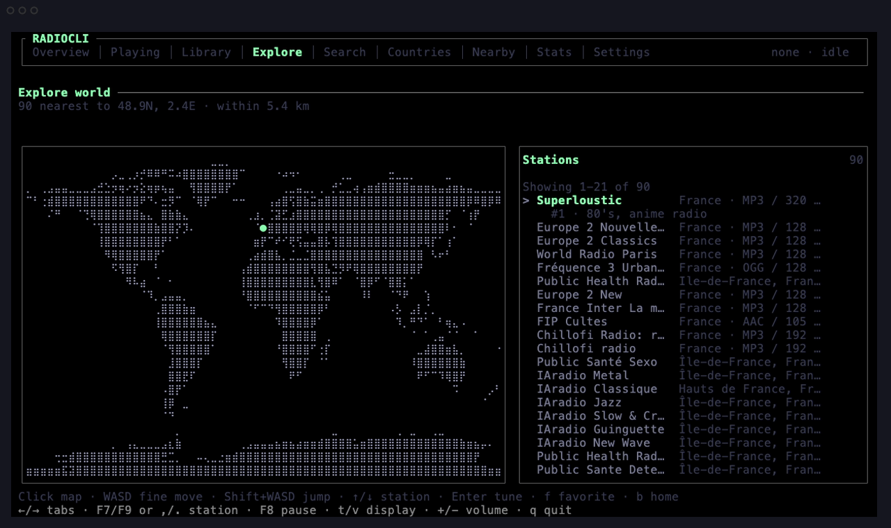
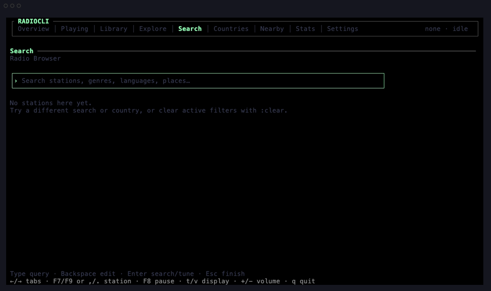
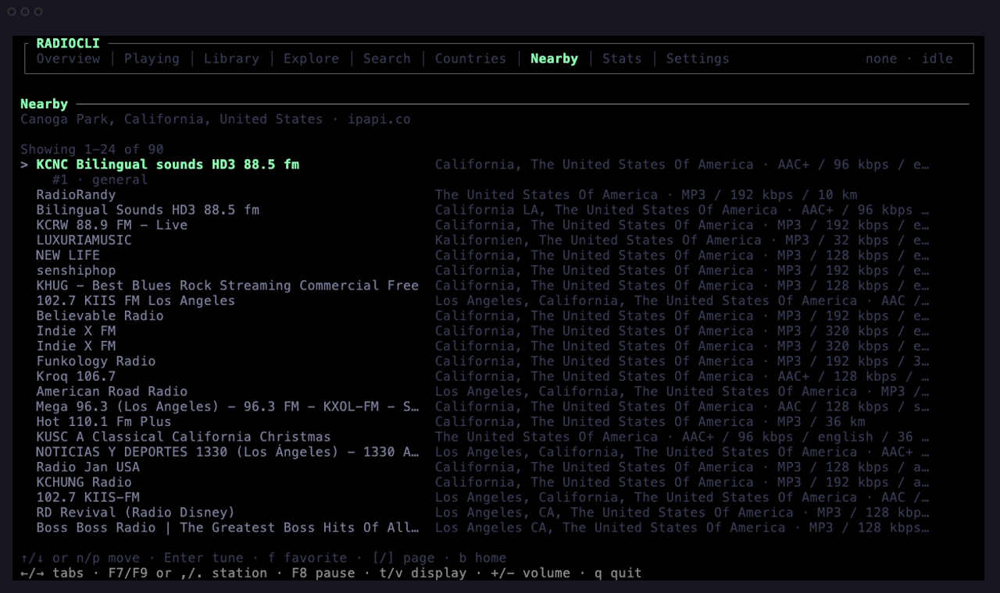
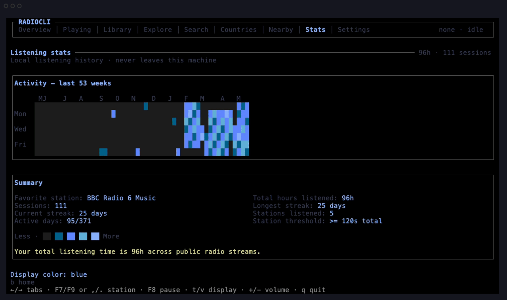

# RadioCLI

[](https://github.com/Ciphore/RadioCLI/actions/workflows/ci.yml)
[](LICENSE)
[](package.json)

RadioCLI is a terminal-first world radio receiver for exploring live public stations, tuning real streams, and keeping your listening history close to the command line.

It is built with [Ink](https://github.com/vadimdemedes/ink), [React](https://react.dev/), [Radio Browser](https://api.radio-browser.info/), and `mpv`. The goal is not a thin wrapper around a station list. The goal is a polished TUI product: fast discovery, resilient stream handling, local-first library state, and the kind of engineering surface that can grow without turning into terminal spaghetti.

## Features

- Explore public radio from around the world through a cosmo-style braille world map beside the station list, with click-to-place mouse support and WASD keyboard movement backed by a cached geotagged station atlas. Country lists, global station search, a country-density map, and opt-in nearby discovery round out the discovery surface.
- Tune stations with `mpv` first for full playback controls, with `ffplay` as a playback-only fallback when available.
- Use a receiver-style Now Playing screen with 50 selectable receiver visualizers, backend status, cleaned ICY track metadata, stream diagnostics, sleep timer, favorite state, `mpv`-backed volume, pause, mute, station skipping, and zero-signal graphics whenever playback is idle, paused, stopped, or not backend-ready.
- Keep shortcuts in a fixed adaptive footer: a compact live station and track row appears above page-specific and global controls while playback is active.
- Move previous/next through the exact station list you tuned from, even after navigating to another screen.
- Browse dense station lists with inline location/codec metadata and yellow favorite stars next to station names.
- Search by station name, place, language, tag, codec, or minimum bitrate.
- Keep local recents, favorites, imported stations, listening activity, playback settings, learned media keys, and provider cache.
- Review listening stats with a GitHub-style local-calendar contribution graph, favorite station, thresholded stations listened, sessions, streaks, active days, and total hours listened from persisted sessions.
- Import `.m3u`, `.pls`, and `.xspf` playlists, including nested local playlists.
- Export favorites and imports as `.m3u`.
- Survive ordinary internet-radio failure modes with provider mirror fallback, stale cache fallback, corrupt-file backups, tune timeouts, and skip-broken-stream behavior.
- Resize with the terminal. The app listens for terminal resize events and recomputes list row counts, map density, receiver width, and compact-mode fallback from the current dimensions.

## Visual Tour

The GIFs below are recorded from the real built TUI with `npm run demo:assets`.
The top GIF cycles multiple Now Playing receiver styles and display colors while
a real stream is playing through `mpv`.

### Library: Favorites And Recents



### Explore: World Map Discovery



### Search: Query Public Station Directories



### Nearby: Opt-In Local Stations



### Stats: Listening History And Display Colors



## Demo

The interactive TUI opens directly into the product, not a marketing screen:

```text
┌ RADIOCLI ──────────────────────────────────────────────────────────┐
│ Overview │ Playing │ Library │ Explore │ Search │ Countries │ … │ idle │
└──────────────────────────────────────────────────────────────────────┘
RADIOCLI  ██████████████████
Live public radio from around the world

> 1 Playing · Receiver display and controls
  2 Library · Favorites, recent stations, imported streams
  3 Explore · Move a map cursor through geotagged stations
  4 Search · Find stations by name, genre, language, place
  5 Countries · Browse by country list with a world-map toggle
  6 Nearby · Opt-in approximate location for local stations
  7 Stats · Listening graph, sessions, streaks, hours
  8 Settings · Playback backend, colors, providers

3 recent · 2 favorites · 1 imported

↑/↓ move · Enter open · number jump · : command
←/→ tabs · F7/F9 or ,/. station · F8 pause · t/v display · +/- volume · q quit
```

The Now Playing screen is a framed receiver panel with **50 selectable receiver styles**. The sample below shows the default pulse-grid display; press `v` to cycle through the catalog, which spans several families:

- **Classic receiver** — equalizer, LEDs, and goniometer.
- **High-resolution braille** — smooth waveform, radial EQ, spectrogram, nebula, silk, ripple tank, phyllotaxis, harmonograph, bloom bars, moiré, galaxy, caustics.
- **Generative & motion** — matrix, hologram, spinning ASCII cube, generated fire, fireworks, plasma, spinning donut, starfield, Lorenz attractor, Barnsley fern, Chladni plate, rotating tesseract, torus knot, fractal tree, Julia sets, and lava-lamp motion.

Visualizers animate only while playback is actually playing and backend-ready; paused, stopped, idle, loading, and error states render a flat zero-signal display instead of a frozen waveform:

```text
Now playing ──────────────────────────────────────────────── mpv · playing
╭────────────────────────────────────────────────────────────────────────╮
│ FM 128.M      RADIOCLI                                           PLAYING │
│ KEXP 90.3 FM                                                            │
│ UNITED STATES · WASHINGTON                                              │
│      ▌       ▌     ▌       ▌       ▌       ▌       ▌       ▌           │
│  ▌   ▌   ▌   ▌ ▌   ▌   ▌   ▌   ▌   ▌   ▌   ▌   ▌   ▌   ▌   ▌           │
│  ▌ ▌ ▌   ▌ ▌ ▌ ▌ ▌ ▌   ▌ ▌ ▌   ▌ ▌ ▌   ▌ ▌ ▌   ▌ ▌ ▌   ▌ ▌ ▌           │
│  ▌ ▌ ▌ ▌ ▌ ▌ ▌ ▌ ▌ ▌ ▌ ▌ ▌ ▌ ▌ ▌ ▌ ▌ ▌ ▌ ▌ ▌ ▌ ▌ ▌ ▌ ▌ ▌ ▌ ▌           │
│  ▌ ▌ ▌ ▌ ▌ ▌ ▌ ▌ ▌ ▌ ▌ ▌ ▌ ▌ ▌ ▌ ▌ ▌ ▌ ▌ ▌ ▌ ▌ ▌ ▌ ▌ ▌ ▌ ▌ ▌           │
│  ▌ ▌ ▌ ▌ ▌ ▌ ▌ ▌ ▌ ▌ ▌ ▌ ▌ ▌ ▌ ▌ ▌ ▌ ▌ ▌ ▌ ▌ ▌ ▌ ▌ ▌ ▌ ▌ ▌ ▌           │
│ MP3 · 128 kbps · english                                                │
│ alternative, indie, seattle                                             │
│ Waiting for ICY track metadata                                          │
│ Backend mpv · Vol 70       ☆ Add favorite (f)             Sleep off     │
╰────────────────────────────────────────────────────────────────────────╯

Playing: KEXP 90.3 FM · Now: Artist - Track · Seattle, Washington, United States · MP3 / 128 kbps / english · mpv · playing · vol 70 · Nearby 4/90
space/F8 pause · f favorite · m mute · s sleep · d diagnostics · b home
←/→ tabs · F7/F9 or ,/. station · F8 pause · t/v display · +/- volume · q quit
```

For the exact non-interactive demo transcript:

```bash
npm run demo:script
```

Recording instructions live in [the demo guide](apps/docs/content/docs/demo.mdx).

## Documentation Website

The public website and the manual now live together in `apps/docs`, a Fumadocs-powered Next app. It renders the homepage at `/`, the documentation tree at `/docs`, docs search at `/api/search`, generated page images, and LLM-readable text routes.

Docs content is written as MDX in `apps/docs/content/docs`, with the navigation tree defined by the local `meta.json` files.

Useful commands from the repo root:

```bash
npm run docs:dev
npm run docs:check
npm run docs:build
```

Set `NEXT_PUBLIC_SITE_URL` for the canonical public docs URL. Preview builds also read Vercel's `VERCEL_URL` and Cloudflare Pages' `CF_PAGES_URL`.

## Install

Requirements:

- Homebrew on macOS: installs RadioCLI, Node.js, and `mpv`
- npm on macOS, Linux, and Windows: Node.js 22 or newer
- `mpv` for playback, pause, mute, volume, media keys, metadata, and readiness checks
- `ffmpeg` plus an audited, compatible sender package on macOS for experimental AirPlay
- `ffplay` from FFmpeg as an optional playback-only fallback

Recommended macOS install:

```bash
brew install ciphore/tap/radiocli
radiocli
```

The Homebrew formula depends on `node` and `mpv`, so the native playback backend
comes from the native package manager.

AirPlay playback on macOS is experimental. RadioCLI discovers AirPlay/RAOP
receivers with Bonjour and decodes streams with `ffmpeg`, but it only advertises
the `airplay` backend when a compatible sender package passes its dependency
safety gate.

```bash
brew install ffmpeg
npm audit --audit-level=low
```

Do not install `node-airtunes2` blindly just to enable this feature: the current
public package line is blocked by RadioCLI because its transitive dependency tree
contains known vulnerable versions. If you supply a patched compatible sender,
passcode-protected receivers prompt in the TUI; enter the code with
`:airplay-code 1234`.

Universal npm install:

```bash
npm install -g @ciphore/radiocli
radiocli doctor
radiocli
```

The npm package is `@ciphore/radiocli`, and the installed executable is
`radiocli`. npm installs RadioCLI and its JavaScript dependencies only; it does
not install system playback tools.

Debian/Ubuntu:

```bash
sudo apt install mpv
npm install -g @ciphore/radiocli
radiocli
```

Fedora, Arch, Alpine, and openSUSE users can install the distro `mpv` package
first, then install `@ciphore/radiocli` with npm.

Native Windows with Windows Terminal or PowerShell:

```powershell
winget install --id OpenJS.NodeJS.LTS -e
winget install --id shinchiro.mpv -e
npm install -g @ciphore/radiocli
radiocli doctor
radiocli
```

Scoop users can use `scoop bucket add extras` and `scoop install mpv` instead
of the `winget` mpv command. WSL remains supported through the Linux path.

Optional `ffplay` fallback support:

macOS/Linux:

```bash
brew install ffmpeg        # macOS
sudo apt install ffmpeg    # Debian/Ubuntu
```

Windows:

```powershell
winget install --id Gyan.FFmpeg -e
```

`ffplay` can keep streams playable when `mpv` is not installed, but it does not
provide reliable pause, mute, volume, media-key, or metadata control. In that
mode RadioCLI labels the backend as `ffplay fallback`, shows limited-control
footer text, and `radiocli doctor` reports `controls=limited`.

CI covers command-mode typecheck, tests, builds, package checks, and fresh
install smoke checks on Ubuntu, macOS, and Windows.

Local checkout:

```bash
git clone https://github.com/Ciphore/RadioCLI.git
cd RadioCLI
npm ci
npm run build
npm link
radiocli
```

If you do not want to link the package globally:

```bash
npm run dev
```

## CLI Usage

```bash
radiocli                 # Start the TUI
radiocli check           # Show local store path, playback backends, provider health
radiocli doctor          # Show playback setup status and install guidance
radiocli countries       # Print top countries by station count
radiocli search "japan hits"
radiocli import stations.m3u
radiocli export favorites.m3u
radiocli add-url <stream-url> [station name]
```

`radiocli export` writes `radiocli-favorites.m3u` when no output path is provided.

After a local build, the same commands can be run with:

```bash
node dist/cli.js check
node dist/cli.js search "lagos talk"
```

## TUI Controls

RadioCLI keeps shortcuts at the bottom of the terminal. When playback is active, a compact live row sits above the shortcuts with station, cleaned track metadata, volume or mute state, and an active sleep timer. The page shortcut row changes with the current screen, and the global transport row stays global:

- `←` / `→` or `Tab` / `Shift+Tab`: move across the top screen tabs.
- `F7` / `F9`, `,` / `.`, or `Shift+←` / `Shift+→`: tune previous or next station from the source list, wherever you are in the TUI.
- `space` / `F8`: pause or resume.
- `t`: cycle display color.
- `v`: cycle receiver style.
- `+` / `-`: volume.
- `q` or `Ctrl+C`: quit cleanly.

Pause, mute, volume, and play/pause media-key control require `mpv`. When only
`ffplay` is active, RadioCLI keeps playback and station skipping available but
labels interactive playback controls as limited and shows an `Install mpv`
warning instead of pretending the control worked.

Page-specific footer controls:

| Screen | Controls |
| --- | --- |
| Home | `↑` / `↓` move, `Enter` open, number jump, `:` command |
| Search input | type query, `Backspace` edit, `Enter` search or tune, `Esc` finish |
| Search results | `/` edit query, `↑` / `↓` or `n` / `p` move, `Enter` tune, `f` favorite, `b` home |
| Explore | click map, `WASD` fine move, `Shift+WASD` jump, `↑` / `↓` station, `Enter` tune, `f` favorite, `[` / `]` page, `b` home |
| Countries | `/` filter, `↑` / `↓` move, `Enter` open stations, `w` map, `b` home |
| World map | `/` filter, `↑` / `↓` move, `Enter` open country, `w` list, `b` home |
| Station lists | `↑` / `↓` or `n` / `p` move, `Enter` tune, `f` favorite, `[` / `]` page, `b` home |
| Now Playing | `space` / `F8` pause, `f` favorite, `m` mute, `s` sleep, `d` diagnostics, `b` home |
| Settings | `Enter` change selected, `g` Radio Garden, `l` location, `x` skip broken streams, `o` backend, `a` AirPlay, `r` health, `b` home |
| Stats | `b` home |

Other active shortcuts:

- `Enter`: open the selected item or tune the selected station without leaving the current list.
- `:`: command palette.
- `/`: edit search or country filter on screens that support it.
- `[` / `]`: page through long station and country lists.
- `m`: mute.
- `o`: cycle playback backend.
- `g`: toggle the experimental Radio Garden adapter.
- `l`: toggle nearby location lookup.
- `x`: toggle skip-broken-stream behavior.
- `r`: refresh provider health.
- `f`: favorite the current or selected station.
- `n` / `p`: move selection; on Now Playing, tune next or previous station from the source list.
- `s`: cycle the sleep timer on Now Playing through off, 15 minutes, 30 minutes, 60 minutes, then off again.
- `d`: stream diagnostics on Now Playing.
- `b`: back home.

When you tune a station from Library, Explore, Search, Countries, or Nearby, that list becomes the playback queue. Previous/next keeps moving through that source list from any screen until you tune from another list.

Hardware media keys depend on the OS and terminal. RadioCLI maximizes compatibility by enabling enhanced keyboard reporting where supported, recognizing common F7/F8/F9 sequences, Kitty consumer/media-key codes, modified-arrow sequences, comma/dot transport fallback, and learned custom bindings. Previous/next media actions stay app-level; play/pause needs the `mpv` backend. Learn keys from Settings or with `:learn previous`, `:learn play`, and `:learn next`; clear them with `:keys reset`.

Explore mouse clicks use terminal mouse reporting while the Explore tab is active. If your terminal or tmux setup does not pass those events through, the WASD cursor controls stay fully available.

Useful command palette entries:

```text
:search lagos jazz
:country japan
:codec MP3
:language spanish
:bitrate 128
:clear
:volume 60
:mute
:favorite
:sleep 15
:sleep off
:timeout 15
:skip off
:location on
:learn previous
:learn play
:learn next
:keys reset
:airplay-code 1234
:map
:library
:stats
:settings
:stop
```

Settings persist display colors and receiver styles without editing config files. The fourteen display colors are green, amber, blue, ruby, ice, teal, violet, copper, cyan, lime, coral, rose, slate, and mono, cycled with `t`. The 50 receiver styles span classic receiver displays, high-resolution braille visuals, and generative motion scenes; cycle them with `v` (see the [Demo](#demo) for the full family breakdown). The stats graph and legend follow the selected display color, and the selected Now Playing style is restored on the next launch.

On macOS, Settings can cycle AirPlay targets discovered through Bonjour when
`ffmpeg` and a compatible sender package pass RadioCLI's dependency safety gate.
Select the `airplay` backend with `o`, choose a receiver with `a`, then tune a
station. If the receiver asks for a code, enter it with `:airplay-code 1234`.

## Architecture

RadioCLI is split around four seams:

- TUI state and screens in `src/ui`
- provider adapters in `src/providers`
- playback lifecycle and metadata in `src/player`
- local JSON persistence in `src/storage`

### Audio Pipeline

Station lists keep provider metadata and a resolvable stream URL. When you tune
a station, `ProviderManager.resolve()` follows the provider-specific path, then
`PlayerController` starts `mpv` with `--no-video`, `--force-window=no`, a local
JSON IPC endpoint, and the configured volume. The endpoint is a Unix socket on
macOS/Linux and a named pipe on native Windows. `ffplay` is available as a
playback-only fallback, but `mpv` is the intended backend because it handles
redirects, HLS, codecs, metadata, pause, mute, volume, media keys, and readiness
checks more reliably than a JavaScript stream client.

RadioCLI waits for the backend to become ready before marking playback as
`playing`. With `mpv`, it polls playback state every 500ms and ICY metadata every
2.5s, then cleans the metadata before showing it in the receiver and live footer.

### FFT Processing

RadioCLI does not currently tap decoded PCM audio or run a real FFT in the Node
process. The receiver visuals are procedural signal displays driven by playback
truth, the selected style, terminal dimensions, theme, and a small `pulse`
counter. That keeps the TUI lightweight and avoids duplicating audio decoding
work already handled by `mpv`. The spectrum-like modes are generated from
deterministic samples, so they should be read as receiver visualizers rather than
measurement-grade audio analysis.

### Terminal Rendering And Refresh Rate

Ink renders React components into ANSI terminal frames. The app recomputes a
terminal layout from the current row/column size, then each screen gets stable
row budgets for station lists, the map, receiver panels, and the adaptive
footer. Visualizers return text rows or colored text segments; the Now Playing
screen frames those rows inside the receiver panel.

Live receiver animation advances every 80ms, about 12.5 frames per second, only
on the Now Playing screen while playback is `playing` and backend-ready.
Ambient/idle-style animation uses a slower 140ms interval, and the loading
spinner uses 120ms. Inactive playback states render zero-signal frames instead
of animating.

### CPU Usage

CPU cost is intentionally bounded: audio decode stays in the native backend,
there is no JavaScript FFT worker, metadata polling is infrequent, and the pulse
timer does not run outside live Now Playing. In practice the terminal renderer
does string and color-segment generation for the current screen only; `mpv` does
the stream work, and idle/library/search/map screens do not pay the visualizer
animation cost.

Radio Browser is the primary provider. Its own docs recommend using a speaking user agent, resolving station clicks through `/json/url`, and retrying with other servers when one fails; RadioCLI follows that shape with mirror fallback and durable cache. Explore and Nearby use a cached geotagged Radio Browser atlas, then compute local distance in the app so map movement is not biased toward the most-clicked stations worldwide. Radio Garden support is experimental because the useful endpoints are publicly discoverable but unofficial, and they can be blocked or changed independently of this project.

Playback prefers `mpv` because it handles real-world streams, redirects, HLS, codecs, and metadata better than a hand-rolled stream client. RadioCLI controls `mpv` through JSON IPC for readiness, pause, mute, volume, and metadata polling, using Unix sockets on macOS/Linux and named pipes on Windows. `ffplay` remains a playback-only fallback and is intentionally labeled with limited controls in the UI and doctor output. Experimental AirPlay output is available on macOS only when Bonjour discovery, `ffmpeg`, and a compatible sender package pass RadioCLI's safety gate.

The npm package is `@ciphore/radiocli`, and the installed executable is `radiocli`. Current installs store data under RadioCLI paths such as `radiocli.json` and `radiocli-cache.json`. Existing Radio Atlas data is still discovered when a new RadioCLI store does not exist, and legacy `RADIO_ATLAS_HOME` / animation environment variables remain supported as migration fallbacks. New automation should use `RADIOCLI_HOME` and `RADIOCLI_DISABLE_ANIMATION`.

Read more:

- [Architecture](apps/docs/content/docs/architecture.mdx)
- [Design notes](apps/docs/content/docs/design.mdx)
- [Reliability](apps/docs/content/docs/reliability.mdx)
- [Roadmap](apps/docs/content/docs/roadmap.mdx)
- [Release packaging](apps/docs/content/docs/release-packaging.mdx)

These also render as a browsable site — run `npm run docs:dev` (see `apps/docs`).

## Engineering Highlights

This repo is intentionally small, but it is built like production software:

- provider boundary instead of UI-coupled fetch calls
- cached geotagged station atlas for true distance-first Explore and Nearby results
- Zod schemas at public API and persistence boundaries
- stale-cache fallback for directory outages
- corrupt store/cache backup instead of silent overwrite
- `mpv` readiness checks before reporting playback as active
- tune timeout and skip-broken-stream behavior
- cleaned ICY metadata, including key/value payloads such as `title="..." artist="..."` and station-specific `text="..."` fields
- source-list playback queues for previous/next transport
- enhanced terminal keyboard parsing with learned media-key bindings
- local-calendar activity bucketing for late-night listening sessions
- local-first privacy posture for history, favorites, imports, and settings
- responsive terminal layout utility with an adaptive footer and focused tests
- smoke tests that exercise live provider data and real playback
- package smoke test that packs the npm artifact, installs it into a fresh temp project, and runs the installed binary

## Privacy

Nearby station discovery is off by default. If you enable it, RadioCLI requests approximate IP-based location from `ipapi.co` and uses the returned city/region/country/coordinates to sort the local geotagged station atlas. Explore uses only the cursor coordinate you move in the terminal. The app does not require an account, does not store secrets, and does not proxy audio. It stores recents, favorites, imports, settings, and provider cache data locally on your machine.

## Development

```bash
npm ci
npm run check
npm run lint
npm run test
npm run build
npm run docs:check
npm run docs:build
npm run smoke:data
npm run verify
npm run smoke:playback
npm run pack:check
npm run fresh:check
npm run verify:release
```

`npm run smoke:playback` briefly opens a public stream through your local playback backend.

## Contributing

Contributions are welcome when they keep the app practical, reliable, and honest about public radio streams. Start with [CONTRIBUTING.md](CONTRIBUTING.md), and include `radiocli check` output for playback issues.

## References

- [Ink README](https://github.com/vadimdemedes/ink)
- [Radio Browser API docs](https://api.radio-browser.info/)
- [mpv JSON IPC manual](https://mpv.io/manual/stable/#json-ipc)
- [Unofficial Radio Garden OpenAPI notes](https://github.com/jonasrmichel/radio-garden-openapi)

## License

MIT. See [LICENSE](LICENSE).
