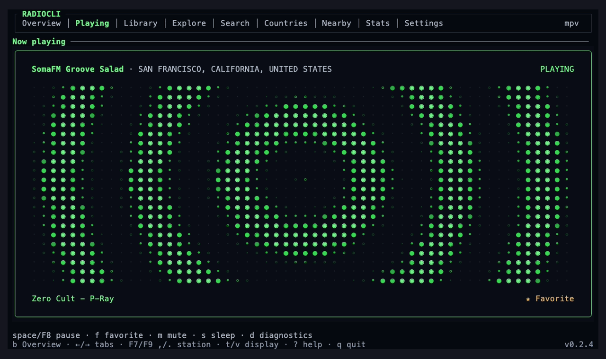
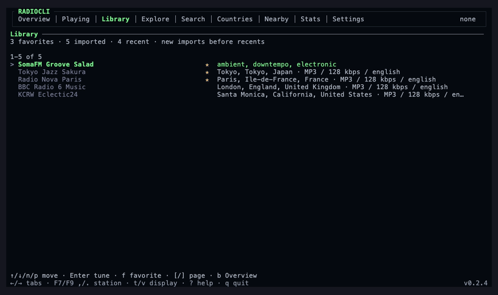
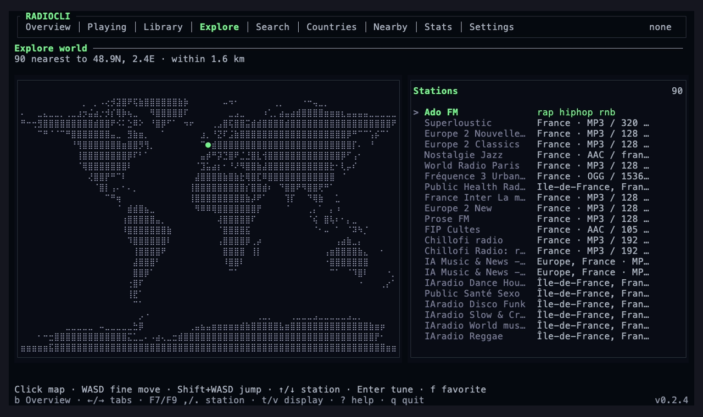
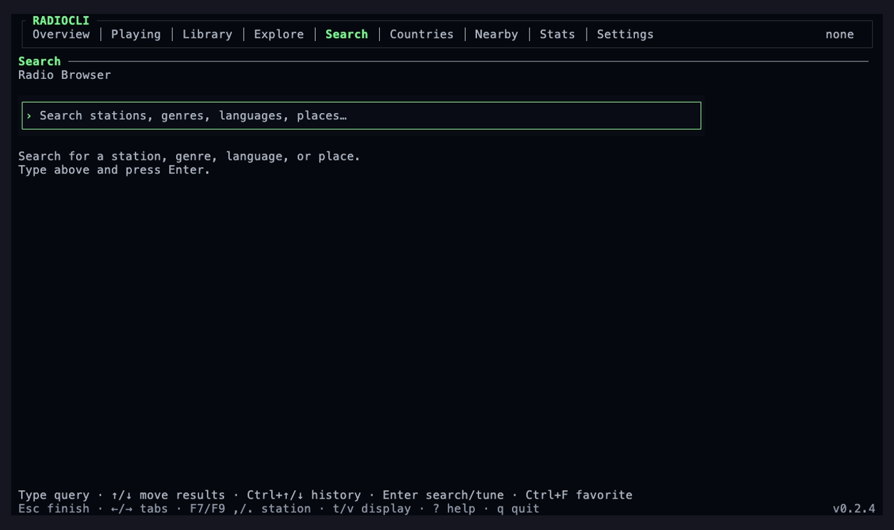
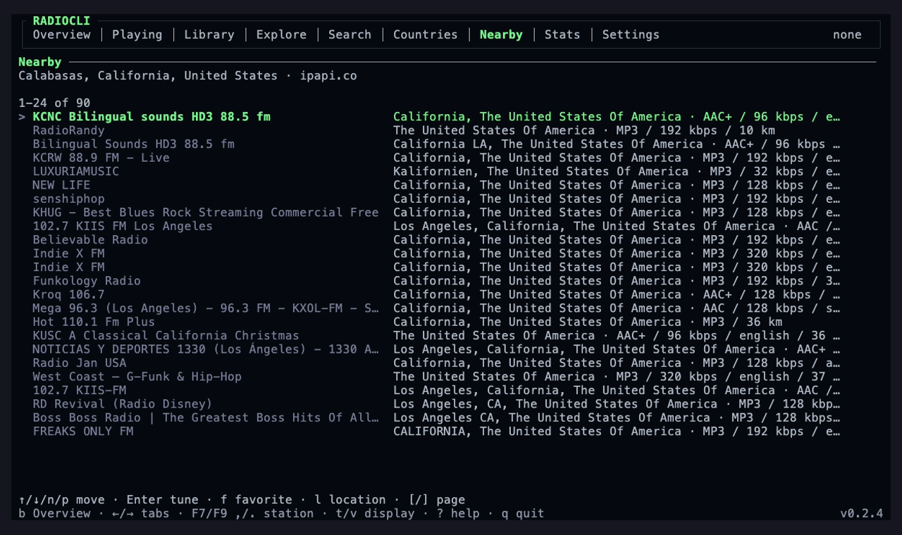
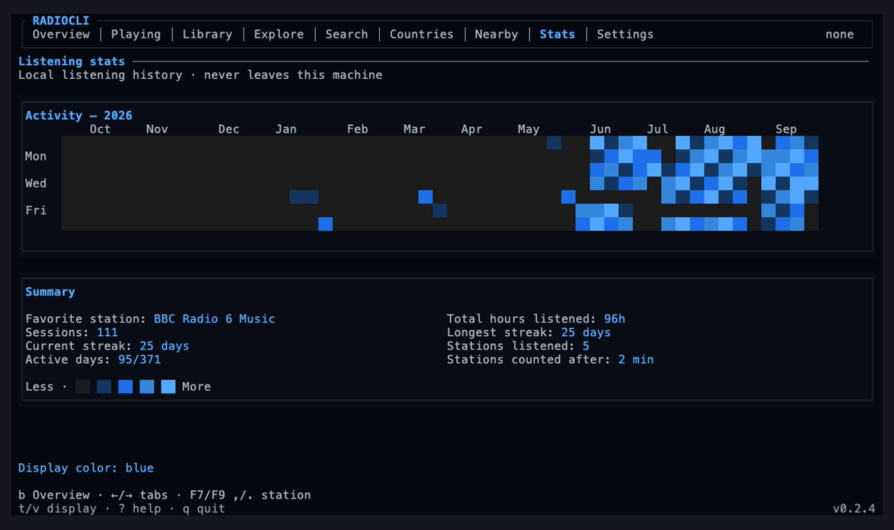

# RadioCLI

[](https://github.com/Ciphore/RadioCLI/actions/workflows/ci.yml)
[](LICENSE)
[](package.json)

RadioCLI brings live radio to your terminal. Browse stations around the world,
save favorites, and listen through `mpv`—without an account or cloud library.

Built with [Ink](https://github.com/vadimdemedes/ink),
[React](https://react.dev/), and the
[Radio Browser](https://api.radio-browser.info/) directory.

## Highlights

- Discover stations through Explore, Search, Countries, or approximate-location Nearby.
- Listen with a receiver-style Now Playing screen, live metadata, sleep timer, diagnostics, and selectable visualizers.
- Keep favorites, recents, imports, track history, and listening stats on your machine.
- Create one-time or recurring radio alarms from the TUI, with native background
  scheduling, station fallback, missed-run grace, snooze, and optional Alarm Guard.
- Move through the exact station list you tuned from with previous and next controls.
- Use `mpv` for complete playback control, with `ffplay` and VLC as limited fallbacks.
- Resize freely: full, compact, and micro layouts preserve navigation and essential controls; Explore retains its interactive world map at every usable size.

## Quick start

macOS with Homebrew:

```bash
brew install ciphore/tap/radiocli
radiocli
```

macOS, Linux, or Windows with npm:

```bash
npm install -g @ciphore/radiocli
radiocli setup
radiocli
```

RadioCLI requires Node.js 22 or newer. The Homebrew formula installs `mpv` and
FFmpeg. After an npm install, `radiocli setup` detects the operating system and
package manager, lets you choose `mpv`, FFmpeg, and VLC, installs the selected
native tools with branded progress feedback, and verifies playback readiness.

See the [installation guide](apps/docs/content/docs/getting-started/install.mdx)
for Windows, Linux distributions, AirPlay prerequisites, and fallback players.

## Visual tour

These recordings come from the built TUI. Generate them locally with
`npm run demo:assets`.

### Library



### Explore



### Search



### Nearby



### Stats



## Essential controls

| Key | Action |
| --- | --- |
| `←` / `→` or `Tab` / `Shift+Tab` | Switch screens |
| `↑` / `↓` or `n` / `p` | Move the selection |
| `Enter` | Open or tune the selection |
| `space` or `F8` | Pause or resume with `mpv` |
| `,` / `.` or `F7` / `F9` | Previous or next station |
| `+` / `-` | Change volume |
| `f` | Save or remove a favorite |
| `?` | Open all shortcuts and commands |
| `q` or `Ctrl+C` twice | Quit cleanly |

The footer always shows controls for the current screen. Press `:` to open the
command palette. The [TUI controls guide](apps/docs/content/docs/getting-started/tui-controls.mdx)
covers filters, playback, media-key learning, AirPlay, and every command.

## CLI

```bash
radiocli                 # Start the TUI
radiocli check           # Check providers, playback tools, and the local store
radiocli doctor --json   # Create a redacted support report
radiocli search "japan hits"
radiocli countries
radiocli import stations.m3u
radiocli export favorites.m3u
radiocli add-url <stream-url> [station name]
radiocli alarm list
radiocli alarm doctor
```

RadioCLI imports `.m3u`, `.pls`, and `.xspf` playlists. It exports favorites
and imported streams as `.m3u`.

Alarms are experimental beta functionality and live under **Overview**,
immediately before Settings. Saving an enabled
alarm registers it with launchd on macOS, a systemd user timer on Linux, or Task
Scheduler on Windows, so the terminal does not need to remain open. When it
fires, RadioCLI reopens the saved supported terminal and shows the ringing
screen. Enter transfers the station into normal interactive playback; Space
stops it and snoozes for 10 minutes. If a
RadioCLI TUI is already open, that instance shows the controls instead. The
computer must still be powered on with a logged-in interactive audio session; wake timing
depends on hardware and OS power policy. See the [CLI guide](apps/docs/content/docs/getting-started/cli.mdx)
and [reliability notes](apps/docs/content/docs/reliability.mdx) before relying on
an alarm for something critical. Use a secondary device as the primary alarm
for safety-critical, medical, travel, or emergency timing. See the dedicated
[Alarms guide](apps/docs/content/docs/alarms.mdx) for the full workflow.

The **Verify alarm setup** row performs a disposable native-scheduler
registration, an authenticated terminal/control handshake, sleep-inhibitor and
system-volume checks, and a short sample from the next configured alarm. It
cleans up the temporary job and reports hard blockers separately from hardware-
or policy-dependent wake limitations.

See the [CLI guide](apps/docs/content/docs/getting-started/cli.mdx) for all
arguments and examples.

## Playback and reliability

RadioCLI prefers `mpv` because it handles redirects, HLS, real-world codecs,
ICY metadata, and interactive controls reliably. `ffplay` and VLC can keep a
stream playing when `mpv` is unavailable, but the UI labels their controls as
limited.

Station providers use mirror fallback, bounded caches, and stale-cache recovery.
Playback waits for backend readiness, applies tune timeouts, and can skip broken
streams. Corrupt library and cache files are backed up instead of silently
overwritten.

Scheduled playback retries the primary station once, then tries an optional
fallback. A missed-run grace window controls catch-up after sleep or logout.
True fade-in requires `mpv`; `ffplay` and VLC start audibly at the configured
target volume. Scheduled alarms always use local speakers, never unattended
AirPlay.

On macOS, an npm or source installation is executed by Node, so System Settings
may identify its background item as `node`. Showing RadioCLI as the providing
application requires a future signed macOS app bundle with a bundled helper;
changing a launchd label cannot safely relabel the executable.

Read the [reliability notes](apps/docs/content/docs/reliability.mdx) for failure
handling and troubleshooting.

## Privacy

RadioCLI does not require an account, proxy audio, or upload your listening
history. Favorites, recents, imports, settings, alarms, track history, and
activity stay in a local JSON library. Full JSON library backups include alarm
definitions, while native scheduler registrations, runtime health, Alarm Guard
state, and authenticated loopback-control tokens remain machine-local.

Nearby contacts `ipapi.co` only when you open that screen, then uses an
approximate location to sort the local station atlas. Disable the lookup with
`l`, Settings, or `:location off`.

Favoriting a Radio Browser station sends a best-effort public directory vote by
default. Turn off **Share favorite votes with Radio Browser** in Settings to
keep favorites local-only.

See [Privacy and security](apps/docs/content/docs/privacy-security.mdx) for the
complete data-flow description.

## Project structure

- `src/ui` — screens, input, layout, and terminal rendering
- `src/providers` — station directories, resolution, and caches
- `src/player` — playback backends, metadata, and AirPlay
- `src/alarms` — schedules, native registration, Alarm Guard, and active controls
- `src/storage` — local library persistence and migration
- `apps/docs` — documentation website and manual

More detail lives in the [architecture guide](apps/docs/content/docs/architecture.mdx)
and [design notes](apps/docs/content/docs/design.mdx).

## Development

```bash
git clone https://github.com/Ciphore/RadioCLI.git
cd RadioCLI
npm ci
npm run verify
npm run dev
```

`npm run verify` checks types, lint, tests, the production build, and package
contents. Playback and live-data smoke tests are available separately because
they contact public services or start a local player.

## Contributing

Contributions are welcome. Start with [CONTRIBUTING.md](CONTRIBUTING.md), and
include `radiocli check` output with playback reports.

## Documentation

- [Getting started](apps/docs/content/docs/index.mdx)
- [Installation](apps/docs/content/docs/getting-started/install.mdx)
- [Controls](apps/docs/content/docs/getting-started/tui-controls.mdx)
- [Architecture](apps/docs/content/docs/architecture.mdx)
- [Roadmap](apps/docs/content/docs/roadmap.mdx)
- [Release packaging](apps/docs/content/docs/release-packaging.mdx)

Run the documentation site locally with `npm run docs:dev`.

## License

[MIT](LICENSE)
